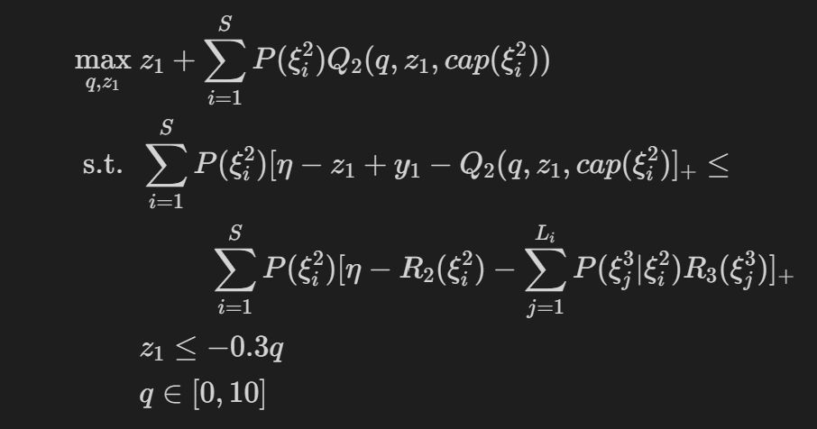
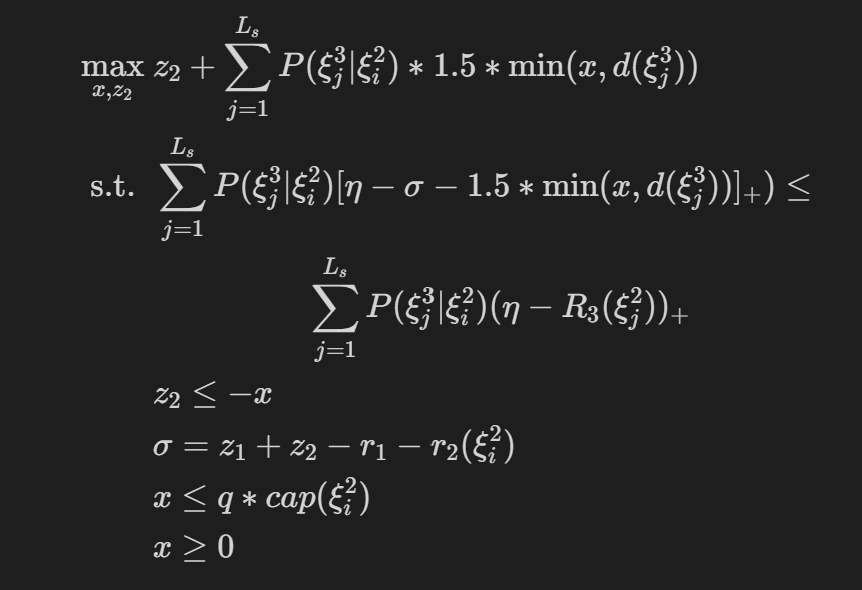

# multicut algorithm for multi-stage stochastic programming with SSD constraints

### This is a working-on respostory
Our eventual goal is to  
(1) establish a solver package implementing the multicut algorithm we proposed to generic multi-stage problem with SSD concerned [1].  

(2) standardize a data format/structure to store the multi-stage problem setting as well as the benchmark information for our SSD method.  

Currently, we have realized our algorithm on a toy problem ---- three-stage news-vendor problem: 

1) First stage: agents require certain units of premium from vendors  
&emsp;variable: 
&emsp;&emsp; &emsp;$ q\in (0,10)$ - units of premium 
&emsp;coeffients: 
&emsp;&emsp; &emsp; -0.3 - cost per unit of premium 
            
2) Second stage: vendor buys news paper from agent, the available quantity range depends on the invesment  
&emsp;  variable: 
&emsp; &emsp; &emsp; $x \in (0,+\infty)$ - units of news paper 
&emsp; coeffients: 
&emsp; &emsp; &emsp;-1 - cost per unit of news paper 
&emsp; random variable: 
&emsp; &emsp; &emsp; $\mathrm{cap}$ - the availble buying quantity is upper bounded by $\mathrm{cap}*q$

3) Third stage: vendor sells news paper to individuals 
&emsp;  variables: 
&emsp; &emsp; &emsp; $z \in (0,x)$, sold quantity of news paper 
&emsp; coeffients: 
&emsp; &emsp; &emsp;1.5 - retail price of news paper 
&emsp;  random variables: 
&emsp; &emsp; &emsp; $d \in (0,+\infty)$, quantity of demands  

We write the SSD constrainted problem in the formulation form of (10)-(15) in [1] , given random reward sequence as $(R_1,R_2,R_3)$:

<!-- 
$$
\begin{align*}
\max_{q,z_1} &~ z_1 + \sum^S_{i=1} P(\xi^2_i) Q_2(q,z_1,cap(\xi^2_i))\\
  \mathrm{s.t.} ~&~\sum^S_{i=1} P(\xi^2_i) [\eta-z_1 +y_1- Q_2(q,z_1,cap(\xi^2_i)]_+\leq \\
  &~~~~~~~~~~\sum^S_{i=1} P(\xi^2_i)[\eta-R_2(\xi^2_i)-\sum^{L_i}_{j=1} P(\xi^3_j|\xi^2_i)R_3(\xi^3_j)]_+\\
  &~ z_1\leq -0.3q\\
  &~ q\in [0,10]
\end{align*}
$$ -->

then $Q_2(q,z_1,cap(\xi^2_i))$ responds to the problem:

<!-- $$
\begin{align*}
\max_{x,z_2} &~ z_2 + \sum^{L_s}_{j=1} P(\xi^3_j|\xi^2_i) * 1.5 * \min(x,d(\xi^3_j))\\
  \mathrm{s.t.} ~&~\sum^{L_s}_{j=1}P(\xi^3_j|\xi^2_i) [\eta-\sigma -1.5 * \min(x,d(\xi^3_j))]_+)\leq  \\
  & ~~~~~~~~~~~~~~~~~~~ \sum^{L_s}_{j=1} P(\xi^3_j|\xi^2_i) (\eta - R_3(\xi^2_j))_+  \\
  &~ z_2\leq -x\\
  &~\sigma = z_1+z_2-r_1-r_2(\xi^2_i) \\
  &~ x\leq q*cap(\xi^2_i)\\
  &~ x\geq 0
\end{align*}
$$ -->

 

### Multi-item news-vendor problem
The above news-vendor is a one-dimensional problem and we will extend this into a multi-dimension by considering multi-items to sell and the vendor can rebalance the stocks after the inital stocking. 
Assuming vendors have $n$ different kinds of items to stock and sell
$$
\begin{align*}
\max_{q,z_1} &~ z_1 + \sum^S_{i=1} P(\xi^2_i) Q_2(x_1,z_1,x_2(\xi^2_i))\\
  \mathrm{s.t.} ~&~\sum^S_{i=1} P(\xi^2_i) [\eta-z_1 +y_1- Q_2(x_1,z_1,x_2(\xi^2_i)]_+\leq \\
  &~~~~~~~~~~\sum^S_{i=1} P(\xi^2_i)[\eta-R_2(\xi^2_i)-\sum^{L_i}_{j=1} P(\xi^3_j|\xi^2_i)R_3(\xi^3_j)]_+\\
  &~ z_1\leq -c_1 x_1\\
  &~ c_1 x_1\leq b_1  \\
  &~ x_1\in R^n_+
\end{align*}
$$
The $Q_2(x_1,z_1,\cdot)$ respoding to  
$$
\begin{align*}
\max_{x,z_2} &~ z_2 + \sum^{L_s}_{j=1} P(\xi^3_j|\xi^2_i)  Q_3(r_2,x_2,\xi^3_j)\\
  \mathrm{s.t.} ~&~\sum^{L_s}_{j=1}P(\xi^3_j|\xi^2_i) [\eta-\sigma - p_2(\xi^2_i) (x_1-r_2)]_+)\leq  \\
  & ~~~~~~~~~~~~~~~~~~~ \sum^{L_s}_{j=1} P(\xi^3_j|\xi^2_i) (\eta - R_3(\xi^2_j))_+  \\
  &~ z_2\leq -c_2(\xi^2_i) x_2 + p_2(\xi^2_i)(x_1 - r_2)\\
  &~ r_2 = \max(x_1-d_2(\xi^2_i),0) \\
  &~\sigma = z_1+z_2-y_1-y_2(\xi^2_i) \\
  &~ c_2(\xi^2_i) x_2\leq p_2 (\xi^2_i) (x_1-r_2) + b_2\\
  &~ x_2\in R^n_+
\end{align*}
$$
$Q_3(r_1,x_2,\xi^3_j)$ is simply evaluated as
$$
\begin{align*}
p_3(\xi^3_j)\min(r_2+x_2,d_3(\xi^3_j))
\end{align*}
$$

### Two jupyter notebook files 

toy_two_stage_newsvendor_SSD showcased how SSD constrainted solution is different from the non-SSD constrainted solution

toy_three_stage_newsvendor_SSD is the toy we showcase our multi-cut algorithm

[1] Darinka Dentcheva, Mingsong Ye, Yunxuan Yi (2022). Risk-averse sequential decision problems with time-consistent stochastic
dominance constraints